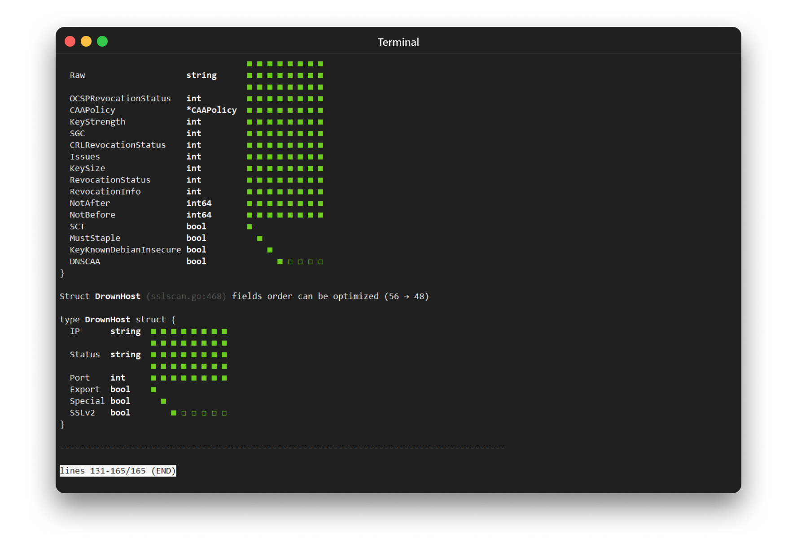

<p align="center"><a href="#readme"></a></p>

<p align="center">
  <a href="https://kaos.sh/w/aligo/ci"></a>
  <a href="https://kaos.sh/r/aligo"></a>
  <a href="https://kaos.sh/b/aligo"></a>
  <a href="https://kaos.sh/w/aligo/codeql"></a>
  <a href="#license"></a>
</p>

<p align="center"><a href="#screenshots">Screenshots</a> • <a href="#installation">Installation</a> • <a href="#command-line-completion">Command-line completion</a> • <a href="#man-documentation">Man documentation</a> • <a href="#faq">FAQ</a> • <a href="#usage">Usage</a> • <a href="#ci-status">CI Status</a> • <a href="#contributing">Contributing</a> • <a href="#thanks">Thanks</a> • <a href="#license">License</a></p>

<br/>

𝑎𝑙𝑖𝑔𝑜 is a utility for checking and viewing Golang struct alignment info.

### Screenshots

<p align="center">
  
  
</p>

### Installation

#### From source

To build the _aligo_ from scratch, make sure you have a working Go 1.19+ workspace (_[instructions](https://go.dev/doc/install)_), then:

```
go install github.com/essentialkaos/aligo/v2@latest
```

#### Using with Github Actions

For using _aligo_ with Github Actions use this workflow file or add job `Aligo` to your workflow:

```yml
name: Aligo

on:
  push:
    branches: [master, develop]
  pull_request:
    branches: [master]

jobs:
  Aligo:
    name: Aligo
    runs-on: ubuntu-latest

    steps:
      - name: Checkout
        uses: actions/checkout@v3

      - name: Set up Go
        uses: actions/setup-go@v2
        with:
          go-version: '1.20.x'

      - name: Check Golang sources with Aligo
        uses: essentialkaos/aligo-action@v2
        with:
          files: ./...
```

### Command-line completion

You can generate completion for `bash`, `zsh` or `fish` shell.

Bash:
```bash
sudo aligo --completion=bash 1> /etc/bash_completion.d/aligo
```

ZSH:
```bash
sudo aligo --completion=zsh 1> /usr/share/zsh/site-functions/aligo
```

Fish:
```bash
sudo aligo --completion=fish 1> /usr/share/fish/vendor_completions.d/aligo.fish
```

### Man documentation

You can generate man page for _aligo_ using next command:

```bash
aligo --generate-man | sudo gzip > /usr/share/man/man1/aligo.1.gz
```

### FAQ

**Q:** I think my struct is well aligned. How can I disable check for it?

**A:** You could add a comment with text `aligo:ignore` for this struct, and _aligo_ will ignore all problems with it. Example:

```go
// This is my supa-dupa struct
// aligo:ignore
type MyStruct struct {
  A bool
  B int
}
```

### Usage


### CI Status

| Branch | Status |
|--------|--------|
| `master` | [](https://kaos.sh/w/aligo/ci?query=branch:master) |
| `develop` | [](https://kaos.sh/w/aligo/ci?query=branch:develop) |

### Contributing

Before contributing to this project please read our [Contributing Guidelines](https://github.com/essentialkaos/contributing-guidelines#contributing-guidelines).

### Thanks

We would like to thank:

- [@mdempsky](https://github.com/mdempsky) for [maligned](https://github.com/mdempsky/maligned) utility;
- [@tyranron](https://github.com/tyranron) for `golang-sizeof.tips` website.

### License

[Apache License, Version 2.0](http://www.apache.org/licenses/LICENSE-2.0)

<p align="center"><a href="https://essentialkaos.com"></a></p>
